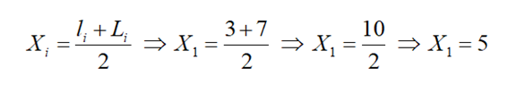
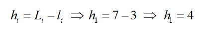

## Introdução

Muitas são as tarefas a serem desempenhadas por um Cientista de Dados, chegando a ser difícil classificar qual delas é a mais importante. Por conta disso, sinto-me confortável, então, para abordar qualquer uma dessas tarefas. Assim, hoje, darei início ao primeiro de quatro textos voltados para a Análise de Dados. 

A importância da análise de dados está voltada, principalmente, para a tomada de decisão. E, para isso, o cientista de dados precisa debruçar-se sobre qual é, de fato, o seu objetivo.

O objetivo vai estar, intimamente, relacionado ao ramo do negócio analisado. Por isso, o cientista de dados precisa conhecer, com detalhes, todas as influências às quais os dados analisados estarão (ou estiveram) sujeitos. Paralelamente a isso, é preciso ter conhecimentos mais técnicos, relacionados aos conceitos estatísticos. Dessa forma, espera-se encontrar uma decisão que podemos considerar como otimizada.

A partir da junção dos conceitos matemáticos, estatísticos, de inteligência artificial e dos grandes conjuntos de dados, é possível encontrar as melhores decisões.

Os conjuntos de dados podem ser analisados segundo quatro tipo de análises: descritiva, diagnóstica, preditiva e prescritiva. Nesse texto, tratarei da análise descritiva.

## Análise Descritiva
Talvez, seja essa, a primeira análise realizada. Seu ponto de partida se dá pelos dados passados (históricos). Assim, é possível explorar o comportamento dos conjuntos de dados, resumindo-os.

Dessa forma, por meio dos dados históricos, é possível conhecer o momento presente do negócio estudado a fim de que se tome uma decisão sem “achismos”, ou seja, fundamentada em fatos.

Para isso, o cientista de dados pode valer-se de três etapas, as quais irei considerar como: (I) Organização dos dados; (II) Visualização dos dados e, (III) Cálculo de Medidas de Tendência Central, Variação e Associação.

## Etapa I: Organização dos Dados
Basicamente, são utilizados os conceitos da Estatística Descritiva. Uma vez que os dados brutos foram obtidos, é preciso tratá-los de maneira a organizá-los, inicialmente, obtendo o rol e, em seguida, elaborando uma distribuição de frequências, por exemplo. Dessa forma, será possível obter um resumo dos dados (categóricos e numéricos), identificar valores e construir gráficos.

É importante o conhecimento de algumas definições, tais como.

**- Dados Brutos:** conjuntos de dados, obtidos após um processo de coleta que, ainda, não foram organizados (tratados).

**- Frequência (absoluta):** corresponde à quantidade de vezes que um mesmo valor é repetido. O mesmo conceito é aplicado no caso das classes.

**- Frequência (relativa):** Corresponde à proporção de observações de um valor (ou de uma classe) em relação ao número total de observações. A frequência relativa é obtida a partir da razão entre a frequência absoluta (de classe) e a soma de todas as frequências absolutas.

**- Frequência (acumulada):** corresponde ao resultado da soma entre uma frequência e todas as que a antecedem na distribuição de frequências.

**- Rol:** representa a ordenação (crescente ou decrescente) de grandezas, sejam elas numéricas ou qualitativas.

**- Classes:** correspondem a intervalos de abrangência. São utilizadas quando as colunas da tabela de frequência contêm muitos valores.

**- Limites inferiores (de classe):** são os menores números que podem pertencer às diferentes classes. Por exemplo, na classe (3-7), o limite inferior corresponderá ao valor 3 e, indicamos por l1 = 4.

**- Limites superiores (de classe):** são os maiores números que podem pertencer às diferentes classes. Utilizando o exemplo anterior, na classe (3-7), o limite superior será ao valor 7 e, indicamos por L1 = 7.

**- Média das classes:** correspondem aos pontos médios dos intervalos que determinam cada uma das classes. Ainda, utilizando o exemplo proposto, é possível determinar a média da classe (3-7), a partir do cálculo.

**- Amplitude de classes:** representada por hi, é o resultado da subtração entre os limites (superior e inferior) de uma classe. Tomando exemplo, a amplitude da classe é obtida pelo cálculo.

## Etapa II: Visualização dos Dados
Essa etapa é caracterizada pela apresentação dos dados, normalmente, a partir de gráficos, por permitir uma melhor visualização e compreensão das distribuições dos dados. Entretanto, deve-se ter o cuidado de se fazer a escolha correta do gráfico que melhor representa os dados que se deseja apresentar. Os gráficos mais comuns são:

**- Gráfico de barras:** é utilizado para realizar comparações entre as categorias de uma variável, sejam elas qualitativas ou quantitativas (no caso, discretas). Pode ser usado com barras horizontais ou verticais. A altura (ou comprimento) das barras representa o que foi mais observado.

**- Gráfico de Setores:** é utilizado para representar uma série categórica. Nesse caso, o conjunto total de dados é representado por um círculo e, cada categoria, corresponde a um setor, cujo ângulo de abertura é proporcional à respectiva frequência que ele representa. Em geral, seu valor é apresentado em porcentagem.

**- Gráfico de Dispersão:** também conhecido como Diagrama de Dispersão, esse gráfico analisa a relação entre duas variáveis quantitativas (uma de causa e uma de efeito), como uma sequência de coordenadas XY.

**- Histograma:** é uma representação gráfica (de barras) da distribuição de frequências de um conjunto de dados quantitativos contínuos, seja por valores absolutos, por frequência relativa ou densidade.

É possível utilizar, ainda, diversos tipos de gráficos (de linha, boxplot, entre outros), conforme a necessidade da análise realizada. Na confecção dessas visualizações podem ser utilizadas inúmeras ferramentas, tais como as bibliotecas Matplotlib e Seaborn do Python; ggplot, no R, além do Tableau e Power BI. Todas essas, ainda, serão alvos de postagens por aqui.

## Etapa III: Cálculo de Medidas de Tendência Central, Variação e Associação
Nessa etapa, serão determinados os sumários estatísticos das variáveis numéricas. É comum realizar as contagens de registros, determinação de campos vazios (ou zeros), os cálculos das médias, dos percentis. é possível, ainda, realizar verificações correlações e regressões. Tópicos que, ainda, abordarei em outras postagens.

Nas próximas postagens, darei prosseguimento nos demais tipos de análises de dados.

